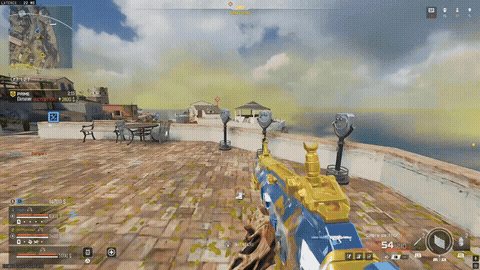

# 🎮 Warzone AI Montage

> Génère automatiquement un montage des temps forts à partir d'un dossier de clips **Call of Duty: Warzone**, en combinant **vision par ordinateur** (détection des kills sur le HUD), **analyse audio** et **transcription vocale**.


On lui donne un **dossier de plusieurs clips/VOD**, il repère les vrais temps forts
(multikills, 2v1/3v1, squad wipes, victoires, moments **proximity chat**), garde les
meilleurs **toutes vidéos confondues**, et monte un clip de **30 s à 2 min** — voix
bien présentes, musique en fond, coupes calées sur le tempo.

## 🎬 Démo



*Montage produit sans intervention manuelle : kills détectés sur le HUD, sélectionnés et assemblés par le programme.*

## Comment ça marche — 3 signaux fusionnés

| Signal | Méthode | Rôle |
|---|---|---|
| **1. Vision du HUD** | *Template matching* (OpenCV) de l'icône de kill / mise à terre / élimination qui flashe à l'écran | Le signal **fiable** — repère les kills indépendamment du son |
| **2. Densité d'action** | Clustering temporel des kills rapprochés | Multikill / 2v1 / 3v1 / wipe → **score élevé** |
| **3. Voix / prox chat** | Transcription Whisper + pics audio | **Booste** quand une voix tombe juste avant un kill (*derniers mots*) ou juste après (réactions) ; victoire détectée par OCR |

Les trois signaux sont **notés ensemble**, on garde les meilleurs moments, avec une
**durée d'extrait adaptative** (un no-scope court, un clutch long) et la victoire en clôture.

```
   clips/ (plusieurs VOD)
        │
        ▼
 ┌──────────────┐   ┌──────────────┐   ┌──────────────┐
 │  vision.py   │   │   audio.py   │   │  killdetect  │
 │ HUD template │   │ pics + voix  │   │ compteur 💀  │
 └──────┬───────┘   └──────┬───────┘   └──────┬───────┘
        └──────────┬───────┴──────────────────┘
                   ▼
            ┌──────────────┐
            │  scoring.py  │  notation + sélection globale
            └──────┬───────┘
                   ▼
            ┌──────────────┐
            │  montage.py  │  coupes beat-sync + render ffmpeg
            └──────┬───────┘
                   ▼
              montage.mp4
```

## 🧱 Stack technique

- **Python** — pipeline modulaire (`wzmontage/`)
- **OpenCV** — détection des kills par template matching sur le HUD
- **librosa / soundfile** — analyse des pics d'action audio
- **faster-whisper** *(optionnel)* — transcription du prox chat
- **pytesseract** *(optionnel)* — OCR de l'écran de victoire
- **FFmpeg** — découpe, beat-sync et rendu final

## Prérequis système

- **ffmpeg** + **ffprobe** (obligatoire)
- **tesseract** (optionnel, détection de victoire)

```bash
sudo apt install ffmpeg tesseract-ocr        # Linux
brew install ffmpeg tesseract                # macOS
# Windows : winget install Gyan.FFmpeg
```

## Installation

```bash
pip install -r requirements.txt
pip install faster-whisper   # optionnel : voix + sous-titres
pip install pytesseract      # optionnel : détection de victoire
```

## Utilisation

```bash
# Montage à partir d'un dossier de clips + musique
python main.py ./clips -m musique.mp3 -o montage.mp4

# Sans vision (si templates pas encore créés) — s'appuie sur audio + voix
python main.py ./clips -m musique.mp3 --no-vision

# Sans transcription voix (plus rapide)
python main.py ./clips -m musique.mp3 --no-voice
```

> Format vertical TikTok : `width: 1080 / height: 1920` dans `config.yaml`.
> Sous-titres du prox chat incrustés : `output.subtitles: true` (Whisper requis).

Le pipeline tourne dès le départ avec **audio + voix**. La détection des kills par
vision s'active une fois les **templates** créés (ci-dessous) et améliore nettement la sélection.

## Calibrage des templates de kill (étape clé)

L'icône de kill dépend de ta résolution / ton HUD : on la capture depuis **tes propres clips**, une seule fois.

```bash
# 1) Cadrer la zone autour de l'icône (vérifie preview.png) :
python calibrate.py clip.mp4 -t 73.5 -r 0.42 0.46 0.06 0.06

# 2) Sauvegarder le template :
python calibrate.py clip.mp4 -t 73.5 -r 0.42 0.46 0.06 0.06 --save-template templates/knock.png
```

Crée idéalement `templates/knock.png`, `templates/elim.png`, `templates/kill.png`, puis
reporte la **zone de recherche** dans `config.yaml → vision.search_region` (et `victory_region` pour le bandeau #1).

> Les templates sont **spécifiques à ton setup** : ils ne sont pas versionnés (`.gitignore`), tu génères les tiens.

## Réglages utiles (`config.yaml`)

| Paramètre | Effet |
|---|---|
| `vision.threshold` | Plus bas = détecte plus de kills (et plus de faux positifs) |
| `scoring.multikill_multiplier` / `wipe_multiplier` | Poids des gros enchaînements |
| `scoring.voice_kill_multiplier` | Importance des moments « derniers mots » |
| `editing.beat_sync` | Cale les coupes sur le tempo de la musique |
| `editing.music_volume` / `game_audio_volume` | Équilibre musique / voix |
| `editing.max_total_seconds` | Durée max du montage |
| `output.subtitles` | Incruste le texte du prox chat |

## Architecture (`wzmontage/`)

| Module | Responsabilité |
|---|---|
| `vision.py` | Template matching de l'icône de kill sur le HUD |
| `killdetect.py` | Détection auto des kills via le compteur 💀 (sans calibrage) |
| `audio.py` | Pics d'action + repérage des passages parlés |
| `scoring.py` | Notation des moments + sélection globale multi-clips |
| `montage.py` | Coupes beat-sync + assemblage FFmpeg |
| `models.py` / `utils.py` | Types partagés + helpers (ffprobe, I/O) |

## Limites honnêtes

- Audio sur **une seule piste** : on détecte la voix mais on ne sépare pas ennemi / équipe (le texte transcrit aide en partie).
- Les templates dépendent de la résolution : à recréer si tu changes de réglages.
- Whisper sur du son de jeu peut produire des transcriptions imparfaites.
- C'est une **première passe automatique** solide, à affiner à la main pour de la pub.
- Pour des clips d'autres joueurs : penser aux droits sur les vidéos sources.

## Roadmap

- [ ] 1vX « pur » via lecture du compteur d'escouades du HUD
- [ ] Modèle YOLOv8 entraîné sur le kill feed (alternative aux templates)
- [ ] Speed-ramp / zoom + SFX sur la frame du kill
- [ ] Autres jeux (Apex, Fortnite…) via le même pipeline modulaire

## Licence

MIT — voir [`LICENSE`](LICENSE).
